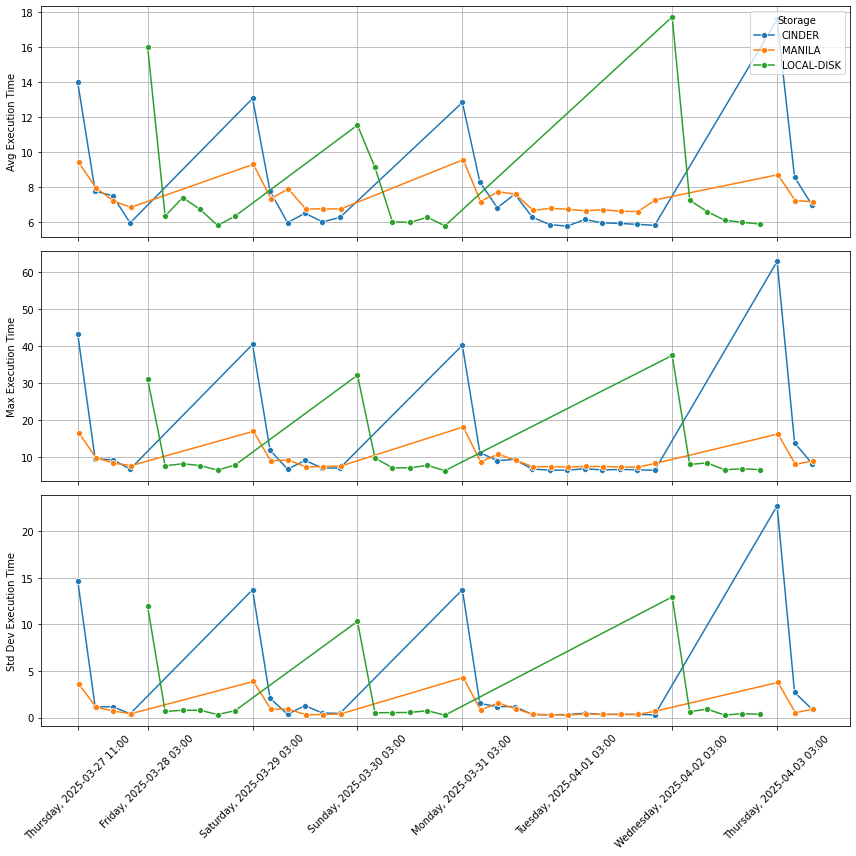

# Automatic Storage Benchmark DP3

<!-- toc -->

## 📝 Description

This project automatically benchmarks three types of storage systems:

- **CephFS (Manila)**
- **CephRBD (Cinder)**
- **Local Disk (SSD)**

### Benchmark Process:
1. Download 81 files (43.9 MB each) from the LOFAR dataset.
2. Average all files into a single 43.9 MB output file.
3. Repeat the process 5 times.

### Metrics Collected:
- Average execution time
- Maximum execution time
- Standard deviation of execution time

---

## 📁 Folder Structure

```
Automatic-DP3-storage-Benchmark/
│
├── Makefiles/                                    # contains the `Makefiles`to
│   ├── Makefile_root_localSSD                    # run in the different storages
│   ├── Makefile_scratch_BS_Cinder 
│   └── Makefile_scratch1_CephFS_Manila
│ 
├── results/                                      # contains the log files
│   ├── times_cinder_manila_local_sleep0          # with the metrics 
│   │ 
│   ├── ....
│   │
│   └── times_cinder_manila_local_sleep6000 
│
├── scripts
│    ├── auto_strgbenchmark_dp3_cinder_manila.sh  # The .sh files automatize the
│    ├── auto_strgbenchmark_dp3_local.sh          # execution of the Makefiles
│    ├── auto_strgbenchmark_dp3_local.sh
│    ├── automize_storagebenchmark_dp3.sh
│    └── get_results_storagebenchmark.py          # pick up results of logFiles
│
├── storage-benchmark-dpe3                        # **Original** package to run
│    ├── scripts                                  # the DP3 Storage Benchmark
│    │      └── singularity-install.sh
│    ├── Makefile
│    └── README.md
│ 
├── crontab_example.txt                           # Example of crontab                     
└── README.md                                     # documentation
```

---

## 🛠️ Requirements

### Prerequisites:
- Linux-based operating system.

### Hardware Requirements:
Benchmark performance depends on CPU speed and memory bandwidth. A faster system yields more accurate storage evaluation results.

---

## 🚀 How to Run

### 1. Install Singularity

Use the provided script to install Singularity:

```bash
cd scripts/
chmod u+x singularity-install.sh
./singularity-install.sh
```

Supports both Debian-based and Fedora-based distributions.

---

### 2. Configure and Run the Benchmark

Place the `Makefile` in the corresponding working directory for the storage system you want to test:

```
/
├── root/
│   └── Makefile
│
├── mnt/
│   ├── scratch/
│   │   └── Makefile
│   │
│   └── scratch1/
│       └── Makefile
```

#### Example `Makefile`:

```makefile
DATA_DIR=/mnt/datavolume
IMAGE_NAME=benchmark_dp3.sif
SINGULARITY_IMAGE=library://your-repo/benchmark_dp3:latest

all: run

pull:
	singularity pull $(IMAGE_NAME) $(SINGULARITY_IMAGE)

run: pull
	singularity exec --bind "$(DATA_DIR):/mnt/data" $(IMAGE_NAME) python3 /mnt/data/images.py /mnt/data
```

#### Run the benchmark:

```bash
make
```

---


## ✅ Sample Results

```bash
100%|█████████████████████████████████████████████████████████████████| 5/5 [00:30<00:00,  6.13s/it]
Average execution time: 6.122 seconds
Max execution time:     6.252 seconds
Std dev execution time: 0.066 seconds
```

---

## ⏱️ Automation with Crontab

Automate benchmark execution every 4 hours using the provided script `automize_storagebenchmark_dp3.sh`.

### Example crontab entry:

```bash
crontab -e
```

Add the following line:

```bash
0 11,15,19,23,3,7 * * * /path/to/automatic-storage-benchmark-dp3/scripts/automize_storagebenchmark_dp3.sh >> /path/to/logs/benchmark.log 2>&1

```
---

## 📦 get results

```bash
get_results_storagebenchmark.py results/get_results_storagebenchmark.py

```


<!-- tocstop -->
